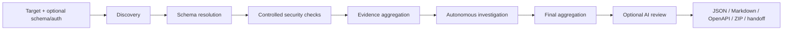
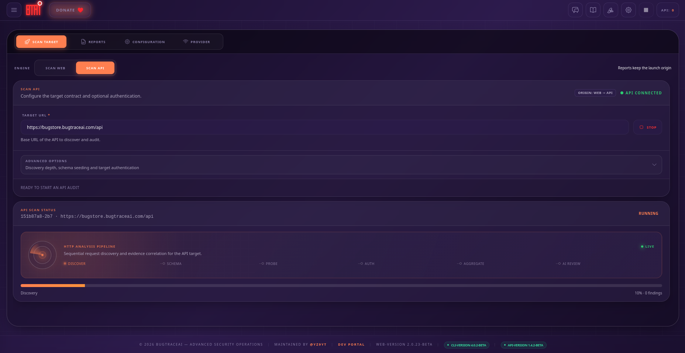
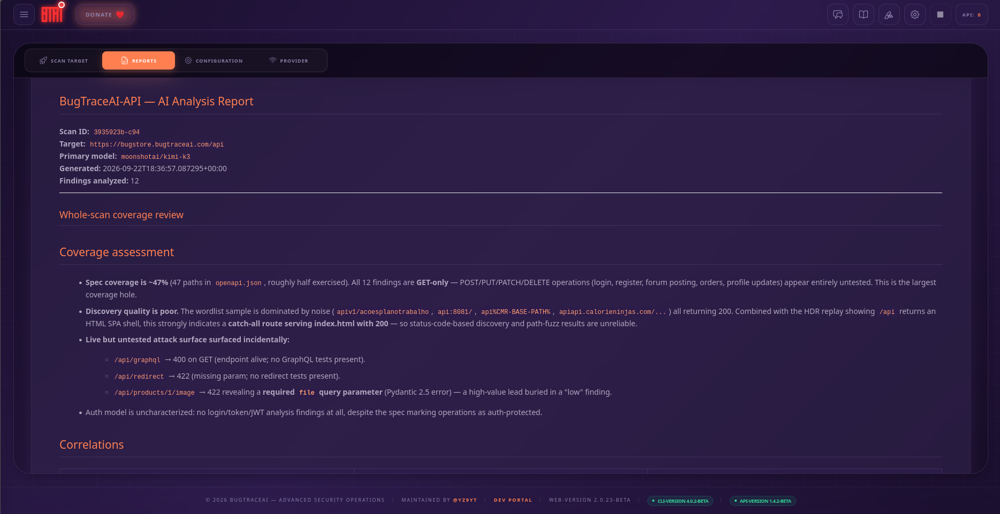

# BugTraceAI-API

<p align="center">
  
</p>

> Standalone, evidence-first API security testing over REST and MCP.

[](LICENSE)
[](VERSION)
[](https://www.python.org/)
[](https://www.docker.com/)
[](#interfaces)

BugTraceAI-API is the independent API-testing engine in the BugTraceAI ecosystem. It discovers API routes, resolves OpenAPI contracts, runs controlled security checks, correlates evidence, investigates hypotheses and produces portable reports.

It does **not** require BugTraceAI-WEB or BugTraceAI-CLI. Run it on a server, drive it through REST or MCP, and retrieve the complete result set through the same API. WEB is an optional visual client; CLI handoff is an optional downstream workflow.

> [!CAUTION]
> Use BugTraceAI-API only against systems you own or are explicitly authorized to test. `audit` mode can send mutating HTTP methods and may change target data.

## Why BugTraceAI-API

- **Truly standalone** — REST API, interactive OpenAPI docs, MCP server, provider configuration and report storage are included.
- **Safe by default** — scans begin in `safe` mode and restrict traffic to `GET`, `HEAD` and `OPTIONS`.
- **Evidence before verdicts** — findings carry classification, confidence, source tools, reproduction data and validation state.
- **Contract-aware** — accepts an OpenAPI URL, attempts schema discovery and generates a portable OpenAPI document from observed routes.
- **Iterative investigation** — turns provisional signals into stateful hypotheses and bounded validation steps before final reporting.
- **Portable output** — JSON findings, Markdown, OpenAPI, a complete ZIP and a redacted CLI handoff pack.
- **Provider-agnostic AI** — local Ollama, OpenRouter, Anthropic and Z.ai profiles are included; AI enrichment is optional.

## Pipeline



The final report distinguishes confirmed evidence from suspicious, hardening and insufficient evidence states. A successful tool execution is not treated as proof of a vulnerability.

## Visual overview

BugTraceAI-API can run independently or as the API engine behind BugTraceAI-WEB.
The same workflow exposes target setup, live pipeline progress, and portable
evidence-rich reports:

<p align="center">
  
</p>

<p align="center"><em>API scan configuration and live pipeline progress.</em></p>

<p align="center">
  
</p>

<p align="center"><em>Evidence-rich API analysis report with coverage assessment and correlations.</em></p>

## Quick start with Docker Compose

### Requirements

- Docker Engine with Docker Compose v2
- Linux `amd64` for the prebuilt Kiterunner, x8 and VulnAPI binaries in the current Dockerfile
- Network access from the container to the authorized target
- Optional: an AI provider key or a local Ollama instance

```bash
git clone https://github.com/BugTraceAI/BugTraceAI-API.git
cd BugTraceAI-API
cp .env.example .env
docker compose up -d --build
```

Compose requires `MCP_PORT` and `API_PORT` in `.env`. In a Launcher
deployment those values are generated from the ports selected in the wizard;
the API image does not impose its own listener or host-port values.

Verify the service using the selected REST port:

```bash
curl "http://localhost:<API_PORT>/health"
```

Expected shape:

```json
{
  "status": "ok",
  "service": "bugtraceai-api",
  "version": "1.4.4-beta",
  "provider": "openrouter",
  "model": "minimax/minimax-m3",
  "api_key_configured": false
}
```

Once running:

- REST API: `http://localhost:<API_PORT>`
- Swagger UI: `http://localhost:<API_PORT>/docs`
- ReDoc: `http://localhost:<API_PORT>/redoc`
- OpenAPI document: `http://localhost:<API_PORT>/openapi.json`
- MCP Streamable HTTP: `http://localhost:<MCP_PORT>/mcp`

The supplied Compose file publishes the Launcher-selected REST/MCP ports and
uses the named `BTAI_SHARED_NETWORK` bridge so a Launcher-managed WEB can reach
the API as `bugtrace-api:<API_PORT>`. Host Ollama is reached through
`host.docker.internal`. Restrict access with a firewall or place the service
behind an authenticated reverse proxy before using it outside a trusted
network.

## First scan

Start a non-mutating scan:

```bash
curl -sS -X POST http://localhost:<API_PORT>/api/scan \
  -H 'Content-Type: application/json' \
  -d '{
    "target": "https://api.example.com/v1",
    "depth": "standard",
    "mode": "safe"
  }'
```

The response immediately returns a scan identifier:

```json
{
  "scan_id": "a1b2c3d4e5f6",
  "status": "started",
  "engine": "api",
  "launch_origin": "api"
}
```

Use that identifier to follow the run and retrieve its results:

```bash
SCAN_ID=a1b2c3d4e5f6

curl -sS "http://localhost:<API_PORT>/api/scan/$SCAN_ID"
curl -sS "http://localhost:<API_PORT>/api/scan/$SCAN_ID/results"
```

Stop an active scan:

```bash
curl -sS -X DELETE "http://localhost:<API_PORT>/api/scan/$SCAN_ID"
```

Only one REST-launched API scan is accepted as active at a time. A second launch returns HTTP `409` with the active scan ID.

## Scan modes

| Mode | Methods | Intended use |
|---|---|---|
| `safe` | `GET`, `HEAD`, `OPTIONS` | Default reconnaissance and non-mutating validation |
| `audit` | Also permits `POST`, `PUT`, `PATCH`, `DELETE` | Explicitly authorized testing where target data may change |

To enable audit behavior:

```bash
curl -sS -X POST http://localhost:<API_PORT>/api/scan \
  -H 'Content-Type: application/json' \
  -d '{
    "target": "https://api.example.com/v1",
    "mode": "audit",
    "allow_mutating": true
  }'
```

`allow_mutating: false` always wins and forces the method gate back to safe methods, even if `mode` is `audit`.

## Authentication and schemas

Pass a primary identity in `auth`. Pass `auth_alt` when authorized BOLA/BFLA comparisons require a second account. Supported authentication shapes include:

```json
{"type":"bearer","token":"<token>"}
```

```json
{"type":"basic","value":"<base64-user-colon-password>"}
```

```json
{"type":"api_key","header":"X-API-Key","value":"<key>"}
```

```json
{"type":"cookie","name":"session","value":"<cookie-value>"}
```

You can also attach additional headers with an `auth.headers` object. Credentials are used for the scan but redacted from the portable handoff. Treat the API request itself as sensitive and use TLS when calling it across a network.

Provide a known contract with `schema_url`:

```bash
curl -sS -X POST http://localhost:<API_PORT>/api/scan \
  -H 'Content-Type: application/json' \
  -d '{
    "target": "https://api.example.com/v1",
    "schema_url": "https://api.example.com/openapi.json",
    "mode": "safe",
    "auth": {"type": "bearer", "token": "<token>"}
  }'
```

## Interfaces

### REST

| Method | Path | Purpose |
|---|---|---|
| `GET` | `/health` | Service, version and active-provider health |
| `POST` | `/api/scan` | Start a scan |
| `GET` | `/api/scan/{scan_id}` | Read scan status and phase progress |
| `GET` | `/api/scan/{scan_id}/results` | Read normalized results |
| `DELETE` | `/api/scan/{scan_id}` | Stop an active scan |
| `GET` | `/api/scans` | List durable scans with cursor pagination |
| `GET` | `/api/scan/{scan_id}/openapi` | Retrieve the resolved/generated OpenAPI document |
| `GET` | `/api/scan/{scan_id}/handoff` | Retrieve the redacted API-to-CLI handoff pack |
| `GET` | `/api/scan/{scan_id}/report-zip` | Download the complete durable report archive |
| `GET` | `/api/scan/{scan_id}/downloads/{artifact}` | Download `findings.json`, `report.md`, `openapi.json` or `handoff.json` |
| `POST` | `/api/investigate` | Run a bounded investigation over an existing scan |
| `GET` | `/api/investigate/{scan_id}` | Read persisted investigation state |
| `GET` | `/api/providers` | List configured provider profiles and models |
| `GET` | `/api/provider` | Read the active provider without exposing secrets |
| `PUT` | `/api/provider` | Select provider/model chain and optionally persist its key |
| `POST` | `/api/provider/test` | Test a provider configuration |

The canonical request and response schemas are always available in Swagger UI and `/openapi.json`.

### MCP

The same container exposes an MCP server on the Launcher-selected MCP port. Available tools include:

- `api_scan`
- `get_scan_status`
- `get_results`
- `stop_scan`
- `investigate_api`

The current runtime prefers MCP Streamable HTTP at `/mcp`; older compatible MCP packages may fall back to legacy SSE. MCP-launched scans always retain `engine: api` and `launch_origin: api` provenance.

## AI providers

AI is used for investigation and final evidence review; discovery and the security tools still run when the selected provider is unavailable.

Create `.env` from the supplied example and set only the provider keys you use:

```dotenv
OPENROUTER_API_KEY=sk-or-v1-...
ANTHROPIC_API_KEY=sk-ant-...
GLM_API_KEY=...
```

Included profiles live in `config/providers/`:

- `openrouter`
- `anthropic`
- `zai`
- `local` (Ollama)

For local Ollama, set `APEX_PROVIDER=local`, `OLLAMA_URL` and `APEX_MODEL`. With Compose, use `http://host.docker.internal:11434`; direct local runs can use `http://localhost:11434`.

Provider selection and UI-managed keys are stored under the mounted `config/` directory. `provider_secrets.json` is intentionally excluded from Git and Docker build contexts. Never commit it.

## Reports and artifacts

Reports persist on the host under `./reports`. Each scan gets an isolated directory containing the original configuration, phase artifacts, normalized findings, tool health, investigation state and final reports.

Useful downloads:

```bash
curl -OJ "http://localhost:<API_PORT>/api/scan/$SCAN_ID/downloads/findings.json"
curl -OJ "http://localhost:<API_PORT>/api/scan/$SCAN_ID/downloads/report.md"
curl -OJ "http://localhost:<API_PORT>/api/scan/$SCAN_ID/downloads/openapi.json"
curl -OJ "http://localhost:<API_PORT>/api/scan/$SCAN_ID/downloads/handoff.json"
curl -OJ "http://localhost:<API_PORT>/api/scan/$SCAN_ID/report-zip"
```

The handoff format is optional interoperability, not a runtime dependency. BugTraceAI-API remains fully usable when no CLI or WEB instance exists.

## Security model

BugTraceAI-API is a security-testing engine, not a public multi-tenant gateway.

- It currently provides **no built-in user authentication or tenant isolation**.
- REST CORS is permissive for integration compatibility.
- The default Compose deployment publishes REST/MCP ports and has no built-in authentication or tenant isolation.
- Provider keys may be persisted locally in `config/provider_secrets.json` with restricted file permissions.
- Reports can contain sensitive endpoint names, response excerpts and security evidence.

Keep it on a trusted management network, restrict the Launcher-selected MCP and REST ports, and terminate TLS plus authentication at a reverse proxy if remote access is required. See [SECURITY.md](SECURITY.md) for vulnerability reporting and deployment guidance.

## Local development

Docker is the reference runtime because it packages the external scanners and wordlists. For Python-only development:

```bash
python3 -m venv .venv
.venv/bin/pip install -r requirements.txt
.venv/bin/pip install ruff pytest pytest-asyncio

make test
make lint
```

Run REST and MCP locally after installing the required external tools:

```bash
.venv/bin/python main.py --sse --host 127.0.0.1 --port <MCP_PORT> --api-port <API_PORT>
```

Common commands:

```bash
make help
make test-fast
make audit
docker compose logs -f bugtrace-api
docker compose down
```

## Project status

BugTraceAI-API is beta software. Security findings should be reviewed against their classification, validation status and attached evidence before remediation or disclosure decisions are made.

## License

Copyright BugTraceAI contributors.

Licensed under the [Apache License 2.0](LICENSE).
